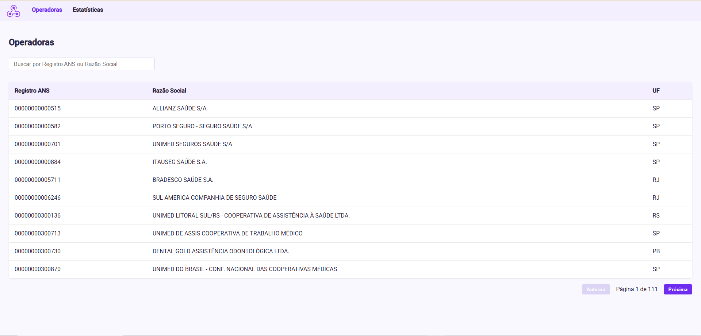
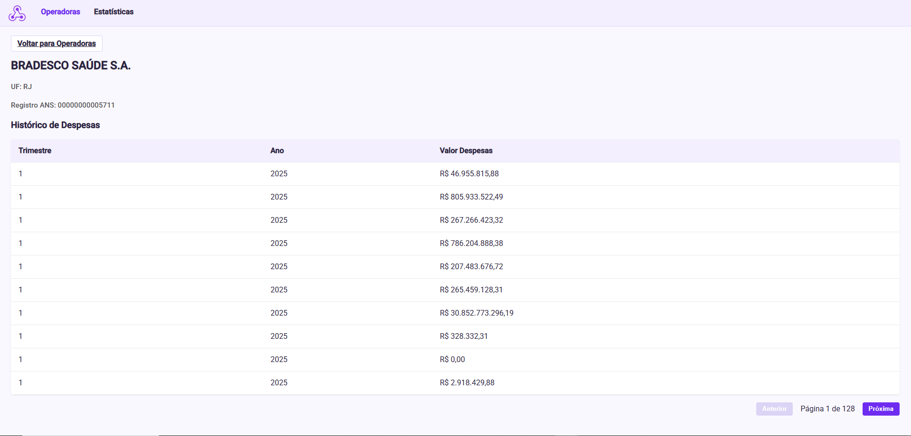
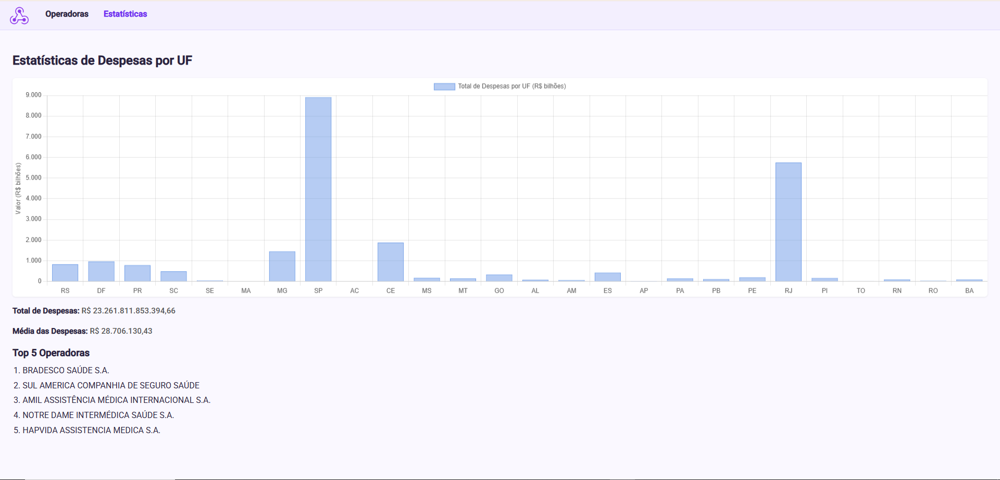
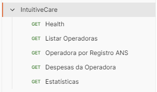

# Desafio Técnico – Intuitive Care

## Objetivo

Este projeto importa, normaliza, consolida e analisa dados financeiros públicos da ANS (Agência Nacional de Saúde Suplementar), permitindo consultas analíticas sobre despesas das operadoras de planos de saúde.

O foco é entregar uma solução funcional, com decisões técnicas justificadas e documentação clara de trade-offs e desvios em relação ao enunciado.

## Tecnologias Utilizadas

- MySQL 8.0+
- Java 17+ / Spring Boot (backend)
- Python 3.8+ (agregação via script)
- Angular (frontend)
- CSV / ZIP (dados públicos ANS)

## Estrutura do Projeto

```bash
intuitivecare-desafio/
├── backend/
│   ├── sql/
│   │   ├── extracted/                # CSVs processados por trimestre (ex.: 1T2025, 2T2025, 3T2025)
│   │   ├── raw/                      # ZIPs originais e CSV de operadoras
│   │   ├── scripts/
│   │   │   └── gerar_despesas_agregadas.py
│   │   ├── ddl.sql                   # Criação das tabelas
│   │   ├── import.sql                # Importação dos CSVs para MySQL
│   │   └── queries_3_4.sql           # Queries analíticas
│   ├── src/
│   │   ├── main/java/com/pitercoding/backend/
│   │   │   ├── config/               # Configurações (RestTemplate)
│   │   │   ├── controller/           # Rotas da API
│   │   │   ├── domain/               # Entidades JPA
│   │   │   ├── dto/                  # DTOs de resposta
│   │   │   ├── repository/           # Repositórios JPA
│   │   │   └── service/              # Regras de negócio e processamento
│   │   └── main/resources/
│   │       └── application.properties
│   └── pom.xml                       # Dependências Maven
├── frontend/
│   ├── src/
│   │   ├── app/
│   │   │   ├── layout/               # Header e layout base
│   │   │   ├── models/               # Modelos de dados
│   │   │   ├── pages/                # Páginas (lista, detalhe, estatísticas)
│   │   │   └── services/             # Serviços HTTP
│   │   └── styles.scss
│   └── angular.json
├── postman/                          # Coleção Postman (JSON)
├── docs/
│   └── images/                       # Imagens do README (opcional)
├── .gitignore
└── README.md               # Documentação principal
```

## Como Executar

### Pré-requisitos

- Java 17+
- Maven
- Node.js 18+ (ou compatível com Angular 20)
- MySQL 8.0+

### Banco de Dados e Scripts

```bash
# 1. Criar banco e tabelas
mysql -u root -p
CREATE DATABASE intuitivecare_db;
USE intuitivecare_db;
source backend/sql/ddl.sql;

# 2. Importar dados brutos
source backend/sql/import.sql;

# 3. Executar agregação Python
python backend/sql/scripts/gerar_despesas_agregadas.py

# 4. Executar queries analíticas
source backend/sql/queries_3_4.sql
```

### Backend (Spring Boot)

```bash
cd backend
./mvnw spring-boot:run
```

API: `http://localhost:8080`

### Frontend (Angular)

```bash
cd frontend
npm install
npm start
```

Frontend: `http://localhost:4200`

### Postman (variável baseUrl)

- `baseUrl`: `http://localhost:8080`

## Processamento de Dados (Implementado)

1. **Coleta e leitura dos arquivos**
   - Download de arquivos ZIP por trimestre e extração automática.
   - Leitura de CSV e XLSX.
   - Processamento em memória (lista), visando simplicidade e velocidade de desenvolvimento.

2. **Consolidação**
   - Geração de `consolidado_despesas.csv` com as colunas:
     - RegistroANS, CNPJ, RazaoSocial, Ano, Trimestre, Valor, UF, NomeFantasia, Modalidade.

3. **Validação**
   - CNPJ válido (formato e dígitos).
   - Valor positivo.
   - Razão Social não vazia.

4. **Enriquecimento**
   - Join com cadastro de operadoras ativas.
   - Enriquecimento por Registro ANS (UF, Modalidade, Nome Fantasia).
   - Registros sem match são exportados separadamente.

5. **Agregação**
   - Cálculo de total, média e desvio padrão por operadora/UF.
   - Geração de `despesas_agregadas.csv` e compactação em `despesas_agregadas.zip`.

## Banco de Dados (MySQL)

Foram criadas tabelas normalizadas:

- `operadora`: dados cadastrais das operadoras ativas
- `despesas_consolidadas`: despesas por operadora, trimestre e ano
- `despesas_agregadas`: métricas calculadas (total, média e desvio padrão)

### Trade-off Técnico – Normalização

**Opção escolhida:** tabelas normalizadas

Justificativa:

- Evita duplicação de dados cadastrais
- Facilita manutenção e atualização
- Queries analíticas continuam simples com JOINs
- Escala melhor para crescimento futuro do volume

### Tipos de Dados

- **DECIMAL(15,2):** valores monetários com precisão
- **DATE:** datas com melhor indexação e comparação

### Importação dos Dados

Realizada via `LOAD DATA INFILE` com:

- Encoding UTF-8
- Ignorar headers
- Conversão automática de valores
- Normalização de CNPJ (apenas números)

Tratamento de inconsistências:

| Problema encontrado              | Estratégia adotada              |
| -------------------------------- | ------------------------------- |
| Valores NULL em campos críticos  | Registro rejeitado              |
| Strings em campos numéricos      | Conversão implícita ou rejeição |
| Datas inconsistentes             | Padronização no processamento   |

## API REST (Java / Spring Boot)

Rotas principais:

- `GET /health`
- `GET /api/operadoras?page=0&size=10`
- `GET /api/operadoras/{registroAns}`
- `GET /api/operadoras/{registroAns}/despesas`
- `GET /api/operadoras/estatisticas`

### Paginação e formato de resposta

Foi utilizada paginação offset-based via `Page` do Spring Data.  
O retorno inclui metadados (total, página, tamanho, primeira/última página), facilitando o consumo no frontend.

## Coleção Postman

Arquivo JSON salvo em: `postman/`.

## Decisões e Trade-offs (Desvios do Enunciado)

1. **Frontend em Angular (em vez de Vue)**
   - Decisão baseada em experiência prévia e velocidade de entrega.
2. **Backend em Java (em vez de Python)**
   - Maior domínio pessoal e robustez para integrações.
3. **Uso de Registro ANS como chave principal**
   - As tabelas originais não traziam CNPJ de forma consistente em todos os arquivos.
   - O Registro ANS é a chave mais estável no conjunto da ANS.
   - CNPJ foi normalizado para 14 dígitos quando disponível.
4. **Processamento em memória**
   - Preferido por simplicidade e tempo de entrega.
   - Volume de dados aceitável para execução local sem streaming.
5. **Zip final**
   - O enunciado pede `consolidado_despesas.zip` ou `Teste_{seu_nome}.zip`.
   - Por simplificação, o ZIP gerado no fluxo é `despesas_agregadas.zip`.
   - Esse ponto foi mantido para evitar refatorações de fluxo.

## Mapeamento do Enunciado x Implementação

| Item do teste | Status | Observação |
| --- | --- | --- |
| 1.1 / 1.2 | Adaptado | Download e leitura implementados em Java; varredura completa do FTP e TXT não foi incluída. |
| 1.3 | Adaptado | CSV consolidado gerado com colunas extras além do exigido. |
| 2.1 | Atendido | Validação de CNPJ, valores positivos e razão social não vazia. |
| 2.2 | Adaptado | Join feito por Registro ANS em vez de CNPJ. |
| 2.3 | Adaptado | Agregação por operadora/UF com métricas; ordenação priorizada no consumo. |
| 3.2 / 3.3 | Atendido | DDL e importação via `LOAD DATA INFILE` com tratamento básico. |
| 3.4 | Parcial | Queries presentes; algumas não seguem exatamente o enunciado. |
| 4.2 | Adaptado | API REST em Java/Spring, não em Python. |
| 4.3 | Adaptado | Frontend em Angular, não Vue. |
| 4.4 | Atendido | Coleção Postman criada em JSON. |

## Imagens

- Tela da lista de operadoras com paginação.  
  
- Tela de detalhe com histórico de despesas.  
  
- Gráfico de despesas por UF.  
  
- Print do Postman com as rotas principais.  
  

## Autor

**Piter Gomes** — Aluno de Ciências da Computação (6º Semestre) e Desenvolvedor Full-Stack

[Email](mailto:piterg.bio@gmail.com) | [LinkedIn](https://www.linkedin.com/in/piter-gomes-4a39281a1/) | [GitHub](https://github.com/pitercoding) | [Portfolio](https://portfolio-pitergomes.vercel.app/) |
